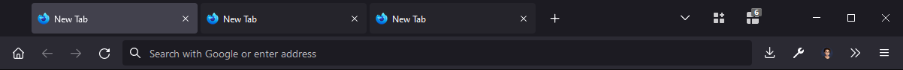
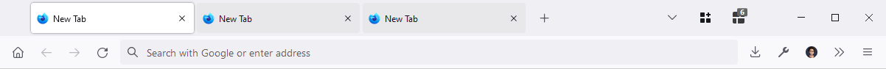

# Firefox Tab Rope

Transforms Firefox' tab rope into a proper tab bar.






## Changes

I upgraded the hover highlight effect from `11%` to `12%` and applied to it the non-hover version but at `4%`.

Darker than `4%`, you don't really see it and it can be a bit hard on the eyes. But at `4%`, the `11%` from the hover is a bit too close, so I bumped it.

While it's specifically made in dark mode and optimized for my own use case, *it works with all themes*. You'll probably want to bump that `4%` to `5%` if you have a busy theme. Edit the two percentages to fit your taste.

## Installation

1. In `about:config`, enable `toolkit.legacyUserProfileCustomizations.stylesheets`
2. `about:support` / *Profile Directory* / **Open Directory**
3. Create folder `chrome` containing the file `userChrome.css`
4. Paste the code below in `userChrome.css`
5. In `about:restartrequired`, click on **Restart Firefox**

```css
.tabbrowser-tab:hover>.tab-stack>.tab-background:not([selected=true], [multiselected]) {
	background-color: color-mix(in srgb, currentColor 12%, transparent);
}

.tabbrowser-tab>.tab-stack>.tab-background:not([selected=true], [multiselected]) {
	background-color: color-mix(in srgb, currentColor 4%, transparent);
}
```
